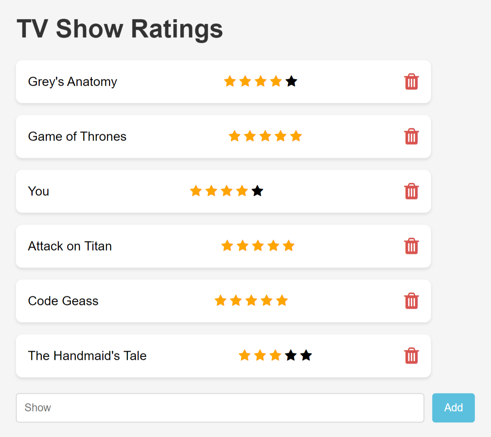

# TV Show Ratings Tracker 📺⭐️

## Description
Welcome to the TV Show Ratings Tracker, a simple web application designed to help you keep track of your favorite TV shows and their ratings. This app allows users to add new shows, rate them using a star-based system, and delete shows when needed. Ratings are saved locally, ensuring they persist across sessions.

### Features
- **User Authentication**: Implements Passport.js for secure local authentication, ensuring user data protection.
- **Note Management**: Add and delete notes (question + answer pairs) for organized note-taking.
- **Dynamic Messages**: View notes from other users, allowing for note-taking in a teamwork setting.
- **Real-time Updates**: Dynamic updates to the UI when adding and deleting notes for a seamless user experience.

### Tech Used
- **HTML/CSS/JavaScript**: Frontend technologies for building an interactive and engaging user interface.
- **Node.js**: Backend JavaScript runtime.
- **Express.js**: Web application framework for Node.js, simplifying route handling and middleware integration.
- **Embedded JavaScript (EJS)**: Templating engine for rendering dynamic content, simplifying the integration of server-side variables into HTML.
- **MongoDB**: NoSQL database for storing user information and TV show data.